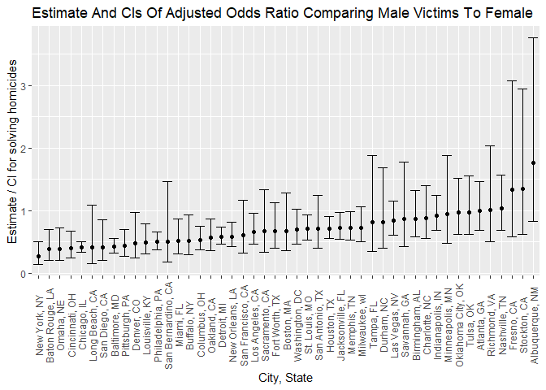

p8105 HW6
================
2022-12-03

``` r
library(tidyverse)
library(modelr)
```

### Problem 2

``` r
homi_data = 
  read.csv("./data/homicide-data.csv") %>%
  janitor::clean_names()
```

Create a city_state variable, and a binary resolved variable of
disposition. Omit data entry mistake and cities that don’t report victim
race. Only consider white and black race .

``` r
homi_data = 
  homi_data %>% 
  mutate(city_state = paste(city, state, sep = ", ", collapse = NULL)) %>%
  mutate(resolved = as.numeric(disposition == "Closed by arrest"),
         victim_age = as.numeric(victim_age)) %>%
  relocate(city_state) %>% 
  filter( !(city_state %in% c("Dallas, TX", "Phoenix, AZ", " Kansas City, MO", "Tulsa, AL")),
    victim_race %in% c("Black", "White")) %>% 
  mutate(
    victim_race = as.factor(victim_race),
    victim_sex = as.factor(victim_sex))
```

In `resolved` variable, 1 represents “Closed by arrest”, 0 represents
“Closed without arrest” or “Open/No arrest”.

For Baltimore, fit a logistic regression of resolved vs unresolved on
victim age, sex and race.

``` r
balt =
  homi_data %>%
  filter(city_state == "Baltimore, MD")
fit_logistic_balt = 
  glm(resolved ~ victim_age + victim_sex + victim_race, family = binomial(), data = balt) 
```

Obtain the estimate and confidence interval of the adjusted odds ratio
for solving homicides comparing male victims to female victims keeping
all other variables fixed.

``` r
balt_fit = fit_logistic_balt %>% broom::tidy() 
balt_est = 
  balt_fit %>% 
  filter(term == "victim_sexMale") %>% 
  mutate(
    OR = exp(estimate),
    conf_lower = exp(estimate - 1.96*std.error),
    conf_upper = exp(estimate + 1.96*std.error))
balt_est
```

    ## # A tibble: 1 x 8
    ##   term         estimate std.error statistic  p.value    OR conf_lower conf_upper
    ##   <chr>           <dbl>     <dbl>     <dbl>    <dbl> <dbl>      <dbl>      <dbl>
    ## 1 victim_sexM~   -0.854     0.138     -6.18 6.26e-10 0.426      0.325      0.558

The adjusted odds ratio is estimated to be 0.4255117 with a 95%
confidence interval (0.324559, 0.5578655).

Fit a logistic regression of resolved vs unresolved on victim age, sex
and race for each city and extract the adjusted odds ratio (and CI) for
solving homicides comparing male victims to female victims.

``` r
func = function(city) {
  city_fit = 
    glm(resolved ~ victim_age + victim_sex + victim_race, family = binomial(), data = city) %>%
    broom::tidy() %>% 
    mutate(
    OR = exp(estimate),
    conf_lower = exp(estimate - 1.96*std.error),
    conf_upper = exp(estimate + 1.96*std.error)) %>%
    filter(term == "victim_sexMale") %>%
    select(OR, conf_lower, conf_upper)
  return(city_fit)
}
```

``` r
city = 
  homi_data %>%
  nest(data = uid:resolved) %>%
  mutate(
    outputs = map(data, func)) %>%
  select(-data) %>%
  unnest(outputs)
city %>%
  knitr::kable(digits = 3)
```

| city_state         |    OR | conf_lower | conf_upper |
|:-------------------|------:|-----------:|-----------:|
| Albuquerque, NM    | 1.767 |      0.831 |      3.761 |
| Atlanta, GA        | 1.000 |      0.684 |      1.463 |
| Baltimore, MD      | 0.426 |      0.325 |      0.558 |
| Baton Rouge, LA    | 0.381 |      0.209 |      0.695 |
| Birmingham, AL     | 0.870 |      0.574 |      1.318 |
| Boston, MA         | 0.674 |      0.356 |      1.276 |
| Buffalo, NY        | 0.521 |      0.290 |      0.935 |
| Charlotte, NC      | 0.884 |      0.557 |      1.403 |
| Chicago, IL        | 0.410 |      0.336 |      0.501 |
| Cincinnati, OH     | 0.400 |      0.236 |      0.677 |
| Columbus, OH       | 0.532 |      0.378 |      0.750 |
| Denver, CO         | 0.479 |      0.236 |      0.971 |
| Detroit, MI        | 0.582 |      0.462 |      0.734 |
| Durham, NC         | 0.812 |      0.392 |      1.683 |
| Fort Worth, TX     | 0.669 |      0.397 |      1.127 |
| Fresno, CA         | 1.335 |      0.580 |      3.071 |
| Houston, TX        | 0.711 |      0.558 |      0.907 |
| Indianapolis, IN   | 0.919 |      0.679 |      1.242 |
| Jacksonville, FL   | 0.720 |      0.537 |      0.966 |
| Las Vegas, NV      | 0.837 |      0.608 |      1.154 |
| Long Beach, CA     | 0.410 |      0.156 |      1.082 |
| Los Angeles, CA    | 0.662 |      0.458 |      0.956 |
| Louisville, KY     | 0.491 |      0.305 |      0.790 |
| Memphis, TN        | 0.723 |      0.529 |      0.988 |
| Miami, FL          | 0.515 |      0.304 |      0.872 |
| Milwaukee, wI      | 0.727 |      0.499 |      1.060 |
| Minneapolis, MN    | 0.947 |      0.478 |      1.875 |
| Nashville, TN      | 1.034 |      0.685 |      1.562 |
| New Orleans, LA    | 0.585 |      0.422 |      0.811 |
| New York, NY       | 0.262 |      0.138 |      0.499 |
| Oakland, CA        | 0.563 |      0.365 |      0.868 |
| Oklahoma City, OK  | 0.974 |      0.624 |      1.520 |
| Omaha, NE          | 0.382 |      0.203 |      0.721 |
| Philadelphia, PA   | 0.496 |      0.378 |      0.652 |
| Pittsburgh, PA     | 0.431 |      0.265 |      0.700 |
| Richmond, VA       | 1.006 |      0.498 |      2.033 |
| San Antonio, TX    | 0.705 |      0.398 |      1.249 |
| Sacramento, CA     | 0.669 |      0.335 |      1.337 |
| Savannah, GA       | 0.867 |      0.422 |      1.780 |
| San Bernardino, CA | 0.500 |      0.171 |      1.462 |
| San Diego, CA      | 0.413 |      0.200 |      0.855 |
| San Francisco, CA  | 0.608 |      0.317 |      1.165 |
| St. Louis, MO      | 0.703 |      0.530 |      0.932 |
| Stockton, CA       | 1.352 |      0.621 |      2.942 |
| Tampa, FL          | 0.808 |      0.348 |      1.876 |
| Tulsa, OK          | 0.976 |      0.614 |      1.552 |
| Washington, DC     | 0.690 |      0.468 |      1.017 |

Make a plot.

``` r
city_plot = 
  city %>% 
  mutate(city_state = fct_reorder(city_state, OR)) %>%
  ggplot(aes(x = city_state, y = OR)) +
  geom_point() +
  geom_errorbar(aes(ymin = conf_lower, ymax = conf_upper)) +
  theme(axis.text.x = element_text(angle = 90, vjust = 0.5, hjust = 0.5)) +
  labs(title = "Estimate And CIs Of Adjusted Odds Ratio Comparing Male Victims To Female", x = "City, State", y = "Estimate / CI for solving homicides")
city_plot
```

<!-- -->

The adjusted odds ratio is mostly less than 1 in the USA indicating male
cases are harder to solve than female cases. Only Nashville, TN, Fresno,
CA, Stockton, CA, Albuquerque, NM are the exceptions where female cases
are harder to solve than male cases. The odds is the lowest in New York,
NY indicating that in New York, NY, male cases are the hardest to solve
comparing to female cases.
